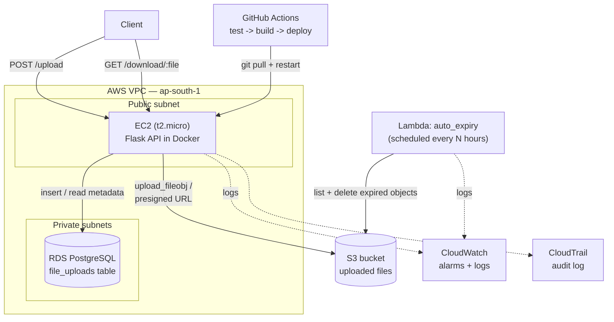

# Architecture

## Overview

CloudVault is a small Flask API backed by three AWS services, each responsible for one concern: **S3** stores the file bytes, **RDS (PostgreSQL)** stores metadata about each upload, and a scheduled **Lambda** enforces the retention policy. The API itself runs on a single EC2 instance inside a VPC, deployed by GitHub Actions through a self-hosted runner.

## Request flows

**Upload** (`POST /upload`)
1. Client sends a file as `multipart/form-data`.
2. The API streams it straight to S3 under its original filename.
3. A row is written to `file_uploads` (RDS) with the filename, S3 key, upload time, and a computed expiry time (upload time + 24h).

**Download** (`GET /download/<filename>`)
1. The API asks S3 for a presigned `GET` URL scoped to that key, valid for 1 hour.
2. That URL — not the file itself — is returned to the client. The API never proxies file bytes on download.

**Expiry** (Lambda, scheduled)
1. `auto_expiry.py` lists all objects in the bucket.
2. Any object last modified more than 24 hours ago is deleted.
3. This runs independently of the API, so cleanup still happens even if the Flask app is down.

## Why it's built this way

- **Presigned URLs instead of a public bucket / proxy download** — the bucket stays private; access is only ever granted per-file, for a short window, on request. Nothing is downloadable unless the API explicitly issued a link for it.
- **A Lambda for expiry instead of only an S3 lifecycle rule** — lifecycle rules can also expire objects on a schedule, but they can't easily be extended to also update `file_uploads` in RDS or emit structured logs of what was deleted. Using Lambda keeps that logic in code and reviewable, at the cost of managing a second small function.
- **No NAT Gateway** — RDS lives in a private subnet reachable from the EC2 instance, but the app doesn't need an outbound path to the internet from that subnet, so a NAT Gateway (billed hourly) was left out; this was a deliberate cost trade-off for a personal project, and would be reconsidered for a production workload that needs it.
- **Self-hosted GitHub Actions runner on EC2** — avoids paying for hosted runner minutes and deploys by just `git pull`-ing on the same box the app runs on. The trade-off: the deploy job only runs on push to `main`, and `main` should stay protected (required reviews / no direct external pushes) since anything landing there executes on that runner.
- **CloudTrail + CloudWatch** — CloudTrail records account-level API activity for auditing; CloudWatch holds the app's logs and alarms for the EC2/Lambda side. Both were added specifically to have real audit/monitoring practice, not just the app layer.

## Configuration & secrets

All AWS/DB configuration is read from environment variables (`AWS_REGION`, `S3_BUCKET_NAME`, `DB_HOST`, `DB_PORT`, `DB_NAME`, `DB_USER`, `DB_PASSWORD`) — set via a local `.env` file (gitignored) for development, and via the EC2/Lambda environment configuration in AWS. No credential, key, or account-specific value is hardcoded in the source.

## Related docs

- [vpc-ec2-setup.md](vpc-ec2-setup.md) — VPC/subnet layout and EC2 instance configuration notes.
